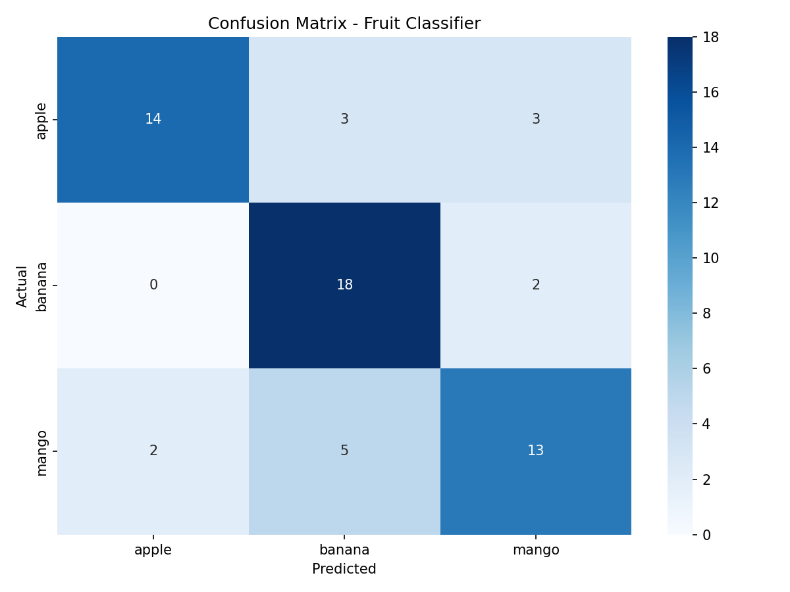

# Fruit AI Classifier

A lightweight CNN-based image classification system for fruit recognition using PyTorch and OpenCV.

## Key Features

- Real-time webcam classification with confidence scores
- Batch image testing with keyboard navigation
- Simple CNN architecture optimized for edge deployment
- Supports extensible fruit class detection

## Performance

| Metric | Value |
|--------|-------|
| Accuracy | 75.00% |
| Loss | 0.6554 |

### Per-Class Metrics

| Class | Precision | Recall | F1-Score |
|-------|-----------|--------|----------|
| Apple | 0.8750 | 0.7000 | 0.7778 |
| Banana | 0.6923 | 0.9000 | 0.7826 |
| Mango | 0.7222 | 0.6500 | 0.6842 |

### Confusion Matrix

## Technical Highlights

- Custom CNN trained from scratch (no pretrained weights)
- Trained on a custom dataset of fruit images (Apple, Banana, Mango)
- 100x100 input resolution for fast inference
- Progressive convolution layers: 32 → 64 filters
- Dense classification head with softmax output
- Cross-platform Python implementation (PyTorch)

## Technologies Used

| Category | Tool |
|----------|------|
| ML Framework | PyTorch |
| Computer Vision | OpenCV |
| Numerical Computing | NumPy |
| Data Processing | scikit-learn |

## Why This Project

This project demonstrates an end-to-end ML pipeline, from data preparation to real-time and batch inference, using a custom CNN trained from scratch. The model achieves 75% accuracy on a balanced 3-class dataset, providing a simple yet effective approach to image classification that can be extended or deployed on resource-constrained devices.

## Limitations

- Limited to 3 classes
- Relatively small dataset
- Moderate accuracy due to simple architecture
